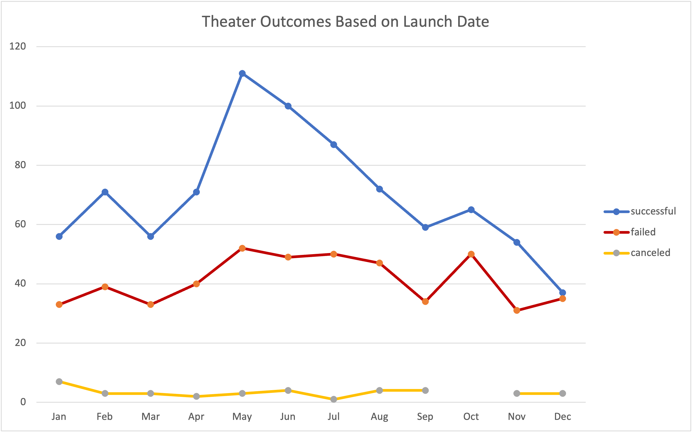

# Analysis of Kickstarter Campaigns

## Overview of Project
An analysis of a Kickstarter fundraising dataset between the years 2009-2017 was performed to uncover trends of successful, failed, and canceled campaigns based on launch dates and funding goals.

### Purpose
This project was completed to assist Louise in determining when fundraising campaigns for plays are most successful. An in depth analysis based on the most productive months and funding goals will provide insight for Louise’s future fundraising project.

## Analysis and Challenges
The initial step in performing the analysis was correctly formatting column categories on the Kickstarter sheet for more comprehensive organization. Conditional formatting was then performed on outcomes to get an initial visual perspective of the data to be further analyzed.
I calculated the percentages funded and average donations for further evaluation when determining outcomes based on goals. I then improved the dataset by implementing the IFERROR formula to correct errors. 

Because Louise wants to specifically focus on the outcomes of plays, I created Parent Category and Subcategory columns. 

I converted the dates in the Deadline and Launched_at columns into two new columns, Date Created Conversion and Date Ended Conversion. Using these columns, I started an Outcomes Based on Launch Date Pivot Table and filtered the results for theater.
I then examined statistical components that later were used in Outcomes Based on Goals.

### Challenges I encountered
Determinations were initially not inherently made due to errors in the original dataset and conversions in the Deadline and Launched_at columns.

### Analysis of Outcomes Based on Launch Date
In the Theater Outcomes Based on Launch Date sheet, I outlined the Successful, Failed, and Canceled results in the columns vs the months of the year in the row labels of a Pivot Table.

### Analysis of Outcomes Based on Goals
In the Outcomes Based on Goals sheet, I organized a table by Goals, Number Successful, Number Failed, Number Canceled, Total Projects, Percentage Successful, Percentage Failed, and Percentage Canceled. Using multiple criteria from the Kickstarter sheet in a COUNTIF formula, I was able to fill each column category based on monetary goal ranges. I used this data to find the percentages of the outcomes.

### Challenges and Difficulties Encountered
When creating the COUNTIF formulas for each outcome category, I forgot to manually add the $ symbol to the formula before the cell numbers. This created an issue when copying the cells and provided incorrect results.

## Results

### Outcomes based on Launch Date

#### First Outcome
Viewing the Theater Outcomes Based on Launch Date data, the first conclusion of the analysis is: the most successful month to launch a Kickstarter campaign for theater projects is May, followed by June and July. December is determined to be the least successful month to launch a campaign. 
#### Second Outcome
The second conclusion is a correlation to the most successful months and the grand total of campaigns launched. There are more than twice the amount of Kickstarter fundraisers started in May than December.

### Outcomes based on Goals

In Outcomes Based On Goals, the results show the most successful outcomes occurred when the goal was less than $5000, especially less than $1000. However, it is to be noted there are outliers when the goals were between $35,000 and $44,999.

### Limitations of this Dataset
#### First Limitation
A limitation I encountered was a lack of information that could lead to an answer as to why the outliers of fundraising goals between $35,000 and $44,999 occurred. There were a total of only 9 campaigns between these monetary goals, meaning larger donations were made between a substantially small group of backers. Without demographic information of the funders, we are missing an opportunity to further fine-tune the outreach of our campaigns for future successful Kickstarter fundraisers. 
#### Second Limitation
Another limitation to consider is Kickstarter campaigns include incentives for donators to receive something in return for different donation milestones. Did Louise provide these, and did they have an effect on outcomes?

### Recommendations for Additional Tables and Graphs
#### First Recommendation
If we were provided additional information for the play subcategory based on genre, I believe the data provided could give us insight on which type of plays are most lucrative to the campaign.
#### Second Recommendation
Because the dataset only provides data from the years 2009-2017, we are missing five years worth of data that could be more relative to now, and show trends that could be more successful for fundraising in 2022.
